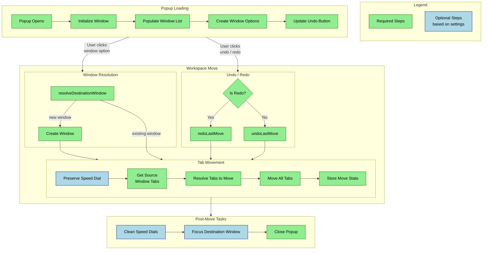

# Tab Movement Architecture

This diagram shows the flow of window content movement operations:

```mermaid
flowchart TD
    classDef required fill:#90EE90,stroke:#006400,color:#000
    classDef optional fill:#ADD8E6,stroke:#000080,color:#000

    subgraph Legend[Legend]
        direction TB
        Required[Required Steps]:::required
        Optional[Optional Steps<br>based on settings]:::optional
    end

    subgraph PL[Popup Loading]
        Start[Popup Opens]:::required --> Init[Initialize Window]:::required
        Init --> Pop[Populate Window List]:::required
        Pop --> CreateOpt[Create Window Options]:::required
        CreateOpt --> UpdateBtn[Update Undo Button]:::required
    end

    PL --> |"User clicks
            window option"| WR
    PL --> |"User clicks
            undo / redo"| UR

    subgraph Workspace Move
        subgraph WR[Window Resolution]
            Resolve[resolveDestinationWindow]:::required
            Resolve --> |"new window"| Create[Create Window]:::required
        end

        subgraph TM[Tab Movement]
            Preserve[Preserve Speed Dial]:::optional --> GetTabs[Get Source<br>Window Tabs]:::required
            GetTabs --> ResTabs[Resolve Tabs to Move]:::required
            ResTabs --> MoveTabs[Move All Tabs]:::required
            MoveTabs --> Store[Store Move State]:::required
        end

        subgraph UR[Undo / Redo]
            Check{Is Redo?}:::required
            Check -->|Yes| Redo[redoLastMove]:::required
            Check -->|No| Undo[undoLastMove]:::required
        end

        Create --> TM
        Resolve --> |"existing window"| TM
        Redo --> TM
        Undo --> TM
    end

    TM --> PMT

    subgraph PMT[Post-Move Tasks]
        Clean[Clean Speed Dials]:::optional
        Clean --> Focus[Focus Destination Window]:::optional
        Focus --> Close[Close Popup]:::required
    end
```
