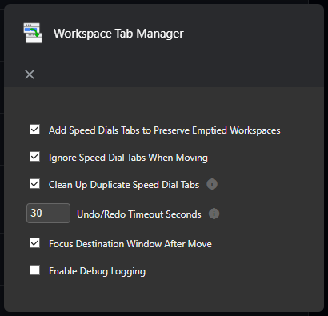

# Installation & Configuration

## Installation

1. Download the extension from the [Opera Addons](https://addons.opera.com/extensions/details/workspace-tab-manager/) page
2. Click the extension icon in your browser toolbar

## Configuration Options

### Speed Dial Handling

- **Add Speed Dials Tabs to Preserve Emptied Workspaces**: When enabled, creates a new speed dial tab in the active workspace, before moving tabs out of the workspace, so that the workspace is maintained when the tabs are moved, rather than immediately closing
  - Helps maintain workspace identity
  - Prevents window closure when moving all tabs
  - Default: Enabled
- **Ignore Speed Dial Tabs When Moving**: When enabled, ignores speed dial tabs when moving tabs, so that they are not moved
  - Default: Enabled
- **Clean Up Duplicate Speed Dial Tabs**: When enabled, cleans up duplicate speed dial tabs, so that only one speed dial tab is left in the original window
  - Default: Enabled

### Undo/Redo

- **Undo/Redo Timeout**: The number of seconds to wait before automatically undoing or redoing a move
  - Default: 30 seconds

### Window Behavior

- **Focus After Move**: Automatically focus the destination window after moving tabs
  - Makes workflow smoother when moving between monitors
  - Default: Enabled

### Troubleshooting

- **Debug Mode**: When enabled, logs detailed information to the console
  - Default: Disabled

Access these settings through:
1. Right-click the extension icon
2. Select "Options"
3. Adjust settings as needed
