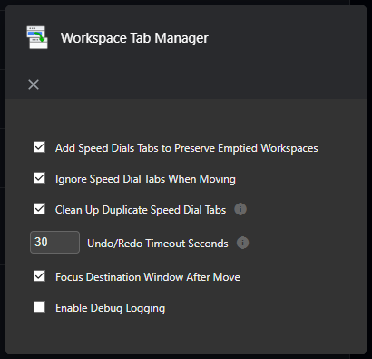

[Home](../index.md) > Installation & Configuration Guide

# Installation

1. Download the extension from the [Opera Addons](https://addons.opera.com/extensions/details/workspace-tab-manager/) page
2. Click the extension icon in your browser toolbar

# Configuration Options

## Speed Dial Handling

- **Add Speed Dials Tabs to Preserve Emptied Workspaces**: Creates a new speed dial tab in the active workspace before moving tabs out, preserving the workspace
  - Helps maintain workspace identity
  - Prevents window closure when moving all tabs
  - Default: ✅ Enabled

- **Ignore Speed Dial Tabs When Moving**: Keeps speed dial tabs in their original window when moving tabs
  - Prevents speed dial proliferation
  - Default: ✅ Enabled

- **Clean Up Duplicate Speed Dial Tabs**: Removes duplicate speed dial tabs after moves
  - Keeps workspace organization clean
  - Default: ✅ Enabled

## Undo/Redo

- **Undo/Redo Timeout**: The number of seconds to wait before automatically undoing or redoing a move
  - Default: 30 seconds

## Window Behavior

- **Focus After Move**: Automatically focus the destination window after moving tabs
  - Makes workflow smoother when moving between monitors
  - Default: ✅ Enabled

## Troubleshooting

- **Debug Mode**: Logs detailed information to the console
  - For development and troubleshooting only
  - Default: ❌ Disabled

**Access these options through:**

1. Right-click the extension icon
2. Select "Options"
3. Adjust options as needed
