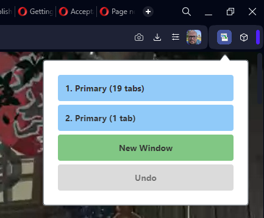

[Home](../index.md) > User Guide

# Using Workspace Tab Manager

## Basic Usage

1. Click the extension icon in your browser toolbar
2. Select your desired destination window from the list
3. All tabs from your current window will move to the selected window

The popup shows:

- Each window with its workspace name and tab count
- Preview of tab names on hover
- "New Window" option in green
- Undo / Redo button (available when applicable)

## Features

### Window Movement

- Move all tabs to an existing window
- Create a new window with all current tabs
- Preview destination window tab names by hovering

### Speed Dial Handling

- Option to utilize Speed Dial tabs as a mechanism by which to preserve the workspace within the window, so that it doesn't close when all the tabs move to another window
- Configure Speed Dial behavior in extension options

### Undo/Redo

- Single-click undo of last move
- Restore previous window state

## Tips

### Workspace Management

- Use for organizing tabs across monitors
- Combine or split workspaces easily
- Utilize Speed Dial tabs for workspace preservation, but avoid moving, duplicating or proliferating them

### Common Use Cases

1. Moving workspace to different monitor
2. Combining multiple workspaces
3. Be able to more effectively use workspaces, because they are not stuck in the window they are in unless you round them up and mouse drag them around
